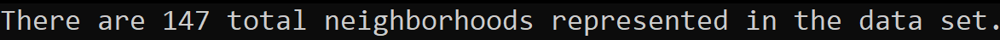
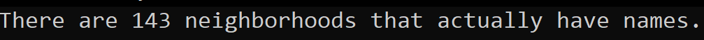
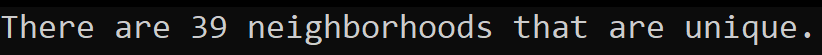

# Lab09 LINQ in Manhattan

*Author: Peyton Cysewski*

----

## Description
Create a program that brings in data from an external file, reads the data, and can filter the data based on specified values.

---

### Getting Started
Clone this repository to your local machine.

```
$ git clone https://github.com/Peyton-Cysewski/Lab09-LINQ.git
```

### To run the program from Visual Studio:
Select ```File``` -> ```Open``` -> ```Project/Solution```

Next navigate to the location you cloned the Repository.

Double click on the ```Lab09-LINQ``` directory.

Then select and open ```Lab09-LINQ.sln```

---

### Visuals

#### Reading in the JSON file

#### Filtering the Neighborhoods

#### Duplicates Removed


---

### Change Log

1.1: *Initial Release* - 16 July 2020


------------------------------